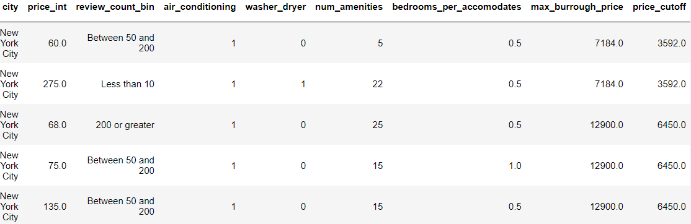
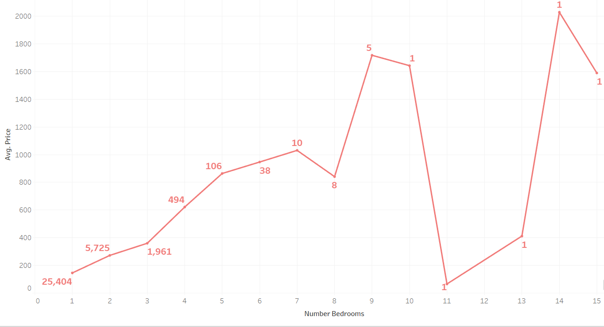
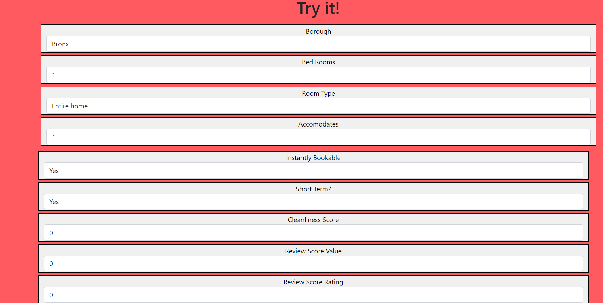
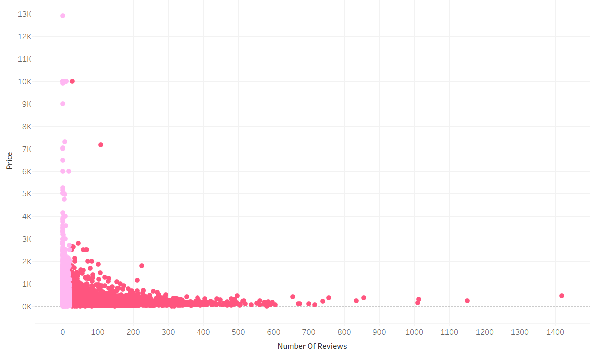
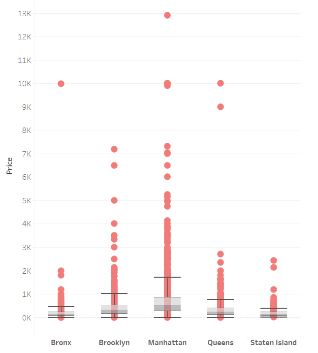

# Airbnb Insights

## Background:

You probably have heard many success stories regarding people making a substantial amount of money posting their properties on Airbnb. To test the accuracy of these claims a machine learning model has been created to test whether or not the prices that are listed for Airbnbs are properly priced. Some of the property types that are being analyzed include: homes, apartments, hotels, etc. For this project different features will be analyzed to see whether or not they have either a positive, negative, or no affect on the price of the listing. New York City will be the topic of this particular project. The source of the data used for this project comes from Inside Airbnb.

## Technologies:

Python, Pandas, Sklearn, Matplotlib, Jupyter Notebook, HTML, CSS, Tableau 

## Contributors:

Ellen Grove, Joshua Yesufu, Anne Pizzini, Zach Meader

## Data Source:

New York City Airbnb data compiled using Inside Airbnb from

http://insideairbnb.com/get-the-data/

## Table of Contents:

1. [ Outlier Removal. ](#outlier)
2. [ Flask Application. ](#flask)
3. [ Airbnb Home Page/HTML. ](#airbnb_html)
4. [ Scatter Plot. ](#scatter_plot)
5. [ Box Plot. ](#box_plot)
6. [ Heat Map. ](#heat_map)
7. [ Conclusion. ](#conc)

### Outlier Removal

After examining the data, we noticed that there was an extensive amount of outliers that affected that data, especially when it came to the average price of an Airbnb listing. These outliers were not included in the model because most of these price outliers are located in Manhattan, NY where Airbnb prices are significantly higher to the point only those in the top 3%-5% could afford it. Another noticeable outlier was the number of bedrooms for each Airbnb listing. Based on the graph below, the price of an Airbnb decreases significantly after to bedrooms, which we thought was odd. For instance, the price drops drastically for an 11 bedroom Airbnb, but then skyrockets when the number of bedrooms reaches 14. Due to the fact that almost all Airbnbs will not have that many rooms, we deemed it necessary not to include anything over 10 bedrooms in the model.

Dataframe(from Jupyter Notebook):

Average Price and Bedrooms Graph:

### Flask Application

In order for the user to have the ability to interact with the model, an application needed to be created to connect the model and the html script. This was constructed by creating an `app.py` file with two distinct routes. The first simply showcases the html constructed for the website. The second contains the main connection between the index file, application, and model. This was completed by adding a form tag in html with the name of the route, `/send`. Once this bridge was established, a button was created for each element and included a name which the app would pull from to populate the values to run inside the model. One caveat to this involves categorical data such as `buroughs` because they are not numerical and the data model has to be run with float values. In order to convert these elements, an if statement was written to change each burough to a string of numbers such as `[0,0,1,0,0]` to run inside the model. Once the data has been completely converted into float values, the model runs and spits out the price based on the features chosenwith a simple jinja function. 

### Airbnb Home Page

For the creation of the the web page we designed a layout that matched Airbnb's company colors, which was completed through bootstrap. Different tabs were created at the top left corner of the page to take viewers of the page directly to the location on the web page of the selected tab. Under this, there is little slideshow of pictures to add more professionalism, and beneath that are the pictures of the creators of this project. As a viewer works their way down the page they will see a brief description about the project along with the methodology, analysis, visuals, model, and features used. To give a viewer a more interactive experience at the very bottom of the page there is a section labeled "Try It", which allows the viewer to select certain features they would like for an Airbnb to have and after doing so a predictive price is generated based on the features choosen.

### Scatter Plot

The scatter plot below displays the relationship between Airbnb prices and the number of reviews. Based on the plot, it could be assumed that the more expensive a property is listed for the less reviews it will have. A reason for this is that more expensive properties tend to price out the majority of the population because most people could not afford them, therefore there will be less reviews because only a small percentage of people can give a valid review. Another noticable feature of the plot is the color range which shows any reviews less than 20 as a light purple color and any reviews over 20 as a dark pink color.

### Box Plot

The box plot created below is centered around each borough and the price of a single night from our data. Without much surprise, manhattan had the widest set of whiskers and total amount of outliers. However, the reasoning behind this visualization is to better understand the number of outliers for each borough. Because there were more than anticipated, there was an opportunity to optimize the model by cutting out the larger outliers. Furthermore, the box plot also offers insights towards the median price for each borough. The speculation around why so many outliers exist is due to the vast types of apartments, homes, and hotels within the greater New York area with all kinds of features. 

### Heat Map

In order to further our understanding of the data and how to optimize our data, a heatmap was created to display the frequency of airbnb spaces within the 5 boroughs. Once again, it was not a huge surprise that manhattan has three distinct red areas but it was interesting to see the lower west side of the island has the highest population than any other area. Furthermore, Brooklyn is the clearly the second most popular borough likely given its accessibility to downtown and the amount housing options. Lastly, the lack of color in the boroughs of Queens and the Bronx provided more context towards which target areas would allow our model to run at a more accurate rate. 

### Conclusion

The desired goal for this project was to create a data model in order to help the average user gain a better understanding for what they should list their home, apartment, or condo on Airbnb. Initially, multiple cities were going to be added into the model but given the plethora of features within more than just one, the model was not providing a very accurate score. Given the aforementioned, the city of New York was decided upon and then the data preprocessing began. By creating multiple visualizations within tableau, the features needed to create a more accurate model started to take shape. This also provided information towards outliers which were removed from the data to also improve the the model. After a desired test score of around 40% was achieved, the construction of the application and website was constructed for users to interact with the model. 9 interactive features were eventually pushed out into our index.html file for users to update their information and within seconds a prediction for the nightly rate of their property becomes available. While there are multiple limitations such as New York being the only city, users now have the ability to better understand the key factors within the pricing of their property. 
